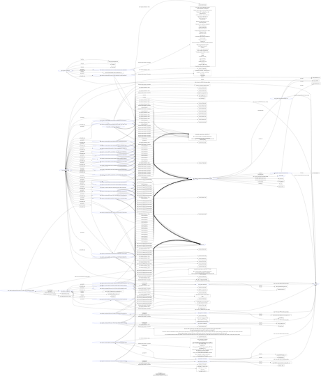

Linked Data is a term that arose from the Semantic Web movement, which aims to describe data on the web, sothat it is machine- and human-readable.

To achieve this, one has to use current Web standards, like RDF (Resource Description Framework) and SPARQL (Query Language for RDF data).

Linked Data is a method of connecting structured data on the web, allowing data from different sources to be easily combined and queried.

For the ERC-777 dataset, we can visualize the entire dataset (even though it is more useful to query the dataset with SPARQL). The following image has been created by pasting all triples from the ERC-777 dataset into the tool found at [RDF Grapher](https://www.ldf.fi/service/rdf-grapher):

